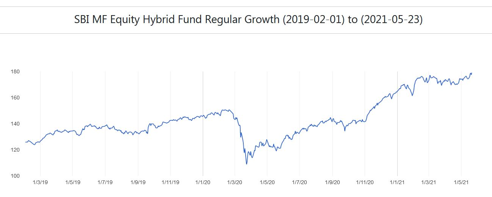
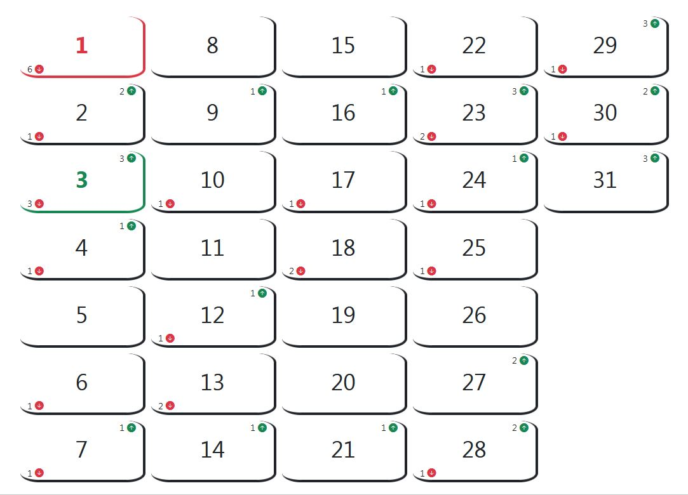

# Stock Price Analyzer

## About

### Information

This is a Stock Analysis and Prediction application. It analyses historical data of stocks and provides insights for predicting when to buy or sell that stock. 

Users can try the application by using sample data provided within the application. Currently the sample data used is of a mutual fund owned by State Bank of India. The mutual fund is commonly known as "SBI Equity Hybrid Fund - Regular Growth".

### Data Format

Users also have the choice to upload their own data in the below JSON format.

```json
{
	"info": "SBI MF Equity Hybrid Fund Regular Growth (2019-02-01) to (2021-05-23)",
	"data": [
		{
			"datetime": "2019-02-01T00:00:00",
			"value": "125.8897"
		},
		{
			"datetime": "2019-02-04T00:00:00",
			"value": "126.0099"
		}
	]
}
```

`info` is an optional attribute which specifies the information of the stock to be analyzed.

`data` is an array of timestamps and relevant values of the stock which will be analyzed.

## Screenshots

1. **Visualization**

<kbd></kbd>

2. **Analysis**

<kbd></kbd>

## Development

This project was generated with [Angular CLI](https://github.com/angular/angular-cli) version 10.0.6.

### Development server

Run `ng serve` for a dev server. Navigate to `http://localhost:4200/`. The app will automatically reload if you change any of the source files.

### Code scaffolding

Run `ng generate component component-name` to generate a new component. You can also use `ng generate directive|pipe|service|class|guard|interface|enum|module`.

### Build

Run `ng build` to build the project. The build artifacts will be stored in the `dist/` directory. Use the `--prod` flag for a production build.

### Running unit tests

Run `ng test` to execute the unit tests via [Karma](https://karma-runner.github.io).

### Running end-to-end tests

Run `ng e2e` to execute the end-to-end tests via [Protractor](http://www.protractortest.org/).

### Further help

To get more help on the Angular CLI use `ng help` or go check out the [Angular CLI README](https://github.com/angular/angular-cli/blob/master/README.md).
